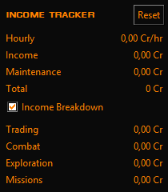

	<h1 align="center">EDMC Income Tracker</h1>
	
An <a href="https://github.com/EDCD/EDMarketConnector">EDMC</a> plugin for tracking income and earnings from various sources in Elite Dangerous

	

## Features

- Track income from trading, combat, exploration, and missions
- Calculate hourly earning rates
- Persistent earnings tracking across sessions
- Configurable display options
- Category breakdown view for Trading, Exploration, Combat, and Missions

<b>Tracked Events</b>

 
<b>Trading:</b>
<pre>MarketSell, MarketBuy, BuyTradeData, SellMicroResources</pre>
<b>Combat:</b>
<pre>RedeemVoucher, FactionKillBond, PayBounties, PayFines</pre>
<b>Exploration:</b>
<pre>SellExplorationData, MultiSellExplorationData, BuyExplorationData</pre>
<b>Missions:</b>
<pre>MissionCompleted, MissionFailed, MissionAbandoned, CommunityGoalReward</pre>
<b>Maintenance:</b>
<pre>RefuelAll, RefuelPartial, Repair, RepairAll, BuyAmmo, BuyDrones, SellDrones, RestockVehicle, Resurrect</pre>

## Installation

1. Clone or [Download](https://github.com/excalith/edmc-income-tracker/releases) the latest release from the
2. Unzip the folder in your EDMC plugins directory
3. Restart EDMC to reload the plugins

## Journal Events References
- [Elite Dangerous Journal Schemas](https://jixxed.github.io/ed-journal-schemas)
- [Elite Journal](https://elite-journal.readthedocs.io)
- [EDCodex](https://edcodex.info/?m=doc)
